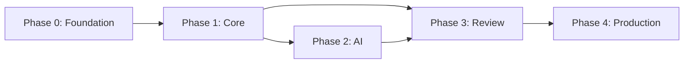

# Resume Builder - Master Backlog

> **"A place for everything and everything in its place."**

This document tracks overall project progress across all phases. Detailed task specifications are in `docs/backlog/phase-X.md` files.

---

## Phase Overview

| Phase | Name | Status | Progress | Description |
|-------|------|--------|----------|-------------|
| **0** | [Foundation](docs/backlog/phase-0.md) | Complete | 8/8 | Development environment, tooling, sample data |
| **1** | [Core Functionality](docs/backlog/phase-1.md) | Complete | 12/12 | Models, parsers, generators, templates |
| **2** | [AI Integration](docs/backlog/phase-2.md) | Complete | 11/11 | Agents, tools, orchestration, contact info |
| **3** | [Review & Polish](docs/backlog/phase-3.md) | Not Started | 0/8 | QA agent, HR agent, accessibility |
| **4** | [Production Ready](docs/backlog/phase-4.md) | Not Started | 0/6 | Integration tests, documentation, optimization |

**Total Tasks**: 45 (P2-T11 added during Phase 1 review)

---

## Phase Dependencies

- **Phase 0** must complete before any other phase
- **Phase 1** must complete before Phase 2 or 3
- **Phase 2 and 3** can run in parallel after Phase 1
- **Phase 4** requires Phase 2 and 3 complete

---

## Quick Links

- [Phase 0: Foundation](docs/backlog/phase-0.md) - Start here
- [Phase 1: Core Functionality](docs/backlog/phase-1.md)
- [Phase 2: AI Integration](docs/backlog/phase-2.md)
- [Phase 3: Review & Polish](docs/backlog/phase-3.md)
- [Phase 4: Production Ready](docs/backlog/phase-4.md)

---

## Status Legend

| Status | Meaning |
|--------|---------|
| `Not Started` | Work has not begun |
| `In Progress` | Active development |
| `Blocked` | Waiting on dependency or decision |
| `Complete` | All acceptance criteria met |

---

## How to Use This Backlog

1. **Pick a task** from the current phase
2. **Read the full spec** in the phase file
3. **Create a branch**: `feat/P<phase>-T<task>-<description>`
4. **Follow TDD**: RED → GREEN → REFACTOR
5. **Update status** when complete

---

## Change Log

| Date | Change |
|------|--------|
| 2024-12-12 | Initial backlog created |
| 2026-02-27 | Phase 1 complete (12/12 tasks merged to main) |
| 2026-02-28 | Phase 2 complete (11/11 tasks merged to main; P2-T11 added for contact info) |
