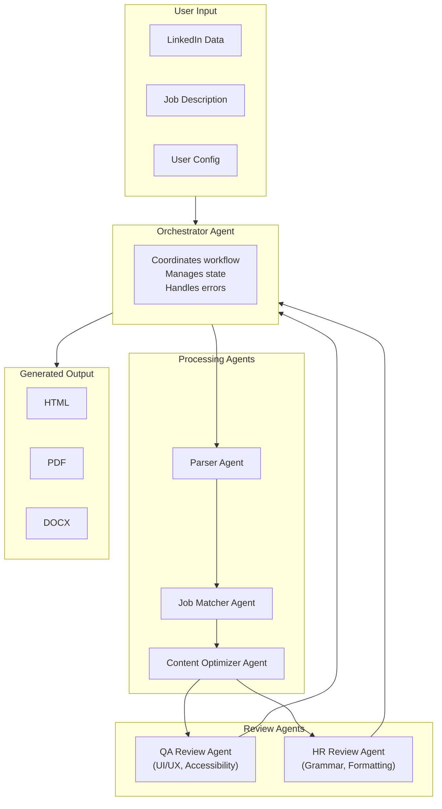

# Resume Builder - Requirements Document

## Project Overview

A professional resume generator that transforms LinkedIn data exports into polished, customizable resumes. The application serves as both a functional tool and a portfolio piece demonstrating engineering excellence in Python development, testing, security, and AI integration.

### Target Use Case

Primary target: Staff Machine Learning Engineer positions at cutting-edge AI companies. The tool itself demonstrates relevant skills in:
- Python development best practices
- AI/LLM integration (Claude API)
- Clean architecture and TDD methodology
- Security-conscious development

### Design Philosophy

> **"A place for everything and everything in its place."**

This project emphasizes:
- **Clean workspace**: No clutter, no unused files, no dead code
- **Clear organization**: Predictable file locations, consistent naming
- **Security by default**: PII protection built into every workflow
- **Minimal footprint**: Only what's needed, nothing more

---

## Functional Requirements

### FR-1: Data Input

| ID | Requirement | Priority |
|----|-------------|----------|
| FR-1.1 | Parse LinkedIn data export CSV files (Profile, Positions, Skills, Education, Certifications, Projects, Publications, Languages, Volunteer) | Must |
| FR-1.2 | Collect additional PII via web form (email, phone, LinkedIn URL, GitHub URL, portfolio URL) | Must |
| FR-1.3 | Store user configuration in local gitignored file (`config.local.json`) with defined schema | Must |
| FR-1.4 | Support drag-and-drop or file upload for LinkedIn data | Should |
| FR-1.5 | Accept job description via text paste, file upload, or URL input | Must |
| FR-1.6 | Enforce maximum file size limit of 10MB per upload | Must |
| FR-1.7 | Validate all user inputs with clear, actionable error messages | Must |
| FR-1.8 | Support batch upload of multiple LinkedIn CSV files (zip archive) | Should |

#### LinkedIn Export Schema

LinkedIn exports data as a ZIP containing multiple CSV files. Expected files:

| File | Required | Key Columns |
|------|----------|-------------|
| `Profile.csv` | Yes | First Name, Last Name, Headline, Summary, Industry, Location |
| `Positions.csv` | Yes | Company Name, Title, Description, Started On, Finished On, Location |
| `Skills.csv` | Yes | Name |
| `Education.csv` | Yes | School Name, Degree Name, Start Date, End Date, Activities |
| `Certifications.csv` | No | Name, Authority, Started On, Finished On, URL |
| `Projects.csv` | No | Title, Description, URL, Started On, Finished On |
| `Publications.csv` | No | Title, Publisher, Publication Date, URL, Description |
| `Languages.csv` | No | Name, Proficiency |
| `Honors.csv` | No | Title, Issuer, Issue Date, Description |
| `Volunteer.csv` | No | Organization, Role, Cause, Description, Started On, Finished On |

> **Note**: LinkedIn may change export formats. The parser should handle missing columns gracefully and log warnings for unexpected schemas.

### FR-2: Resume Sections

The following sections must be supported:

| Section | Source | Priority |
|---------|--------|----------|
| **Header** | Profile.csv + config.local.json | Must |
| **Professional Summary** | Profile.csv (AI-enhanced) | Must |
| **Work Experience** | Positions.csv | Must |
| **Skills** | Skills.csv (categorized) | Must |
| **Education** | Education.csv | Must |
| **Certifications** | Certifications.csv | Should |
| **Projects** | Projects.csv | Should |
| **Publications** | Publications.csv | Should |
| **Languages** | Languages.csv | Should |
| **Volunteer Experience** | Volunteer.csv | Could |
| **Awards & Honors** | Honors.csv | Could |

### FR-3: Output Formats

| ID | Requirement | Priority |
|----|-------------|----------|
| FR-3.1 | Generate HTML output (printable to PDF via browser) | Must |
| FR-3.2 | Generate direct PDF output (WeasyPrint) | Must |
| FR-3.3 | Generate DOCX output (python-docx) | Must |
| FR-3.4 | Maintain visual consistency across all formats | Must |
| FR-3.5 | Generate plain text output for ATS compatibility | Should |
| FR-3.6 | Export resume data as JSON for portability | Could |

### FR-4: Style Options

Four visual styles with consistent structure:

| Style | Description | Accent Color | Font Family |
|-------|-------------|--------------|-------------|
| **Classic/Traditional** | Clean serif fonts, conservative layout | Navy (#1a365d) | Georgia, serif |
| **Modern Minimalist** | Sans-serif, generous whitespace | Slate (#475569) | Inter, sans-serif |
| **Tech-Forward** | Modern sans-serif, color sidebar | Indigo (#4f46e5) | JetBrains Mono headers, Inter body |
| **ATS-Optimized** | Plain formatting, no colors | Black (#000000) | Arial, sans-serif |

> **Customization**: Users may override accent color via config. Font families are fixed per style for consistency.

### FR-5: Length Configuration

| ID | Requirement | Priority |
|----|-------------|----------|
| FR-5.1 | 1-Page option: AI-prioritized highlights only | Must |
| FR-5.2 | 2-Page option: Detailed professional history | Must |
| FR-5.3 | CV (Full) option: Complete listing of all experience | Must |
| FR-5.4 | AI-assisted content prioritization based on job match scores | Should |
| FR-5.5 | Manual toggle for section/item inclusion override | Should |
| FR-5.6 | Preview estimated page count before generation | Should |

#### Content Prioritization Algorithm (1-Page)

For 1-page resumes, include in priority order:
1. Header (always)
2. Professional Summary (always, condensed)
3. Top 3 most relevant positions (based on job match score)
4. Top 8-12 skills (prioritized by job relevance)
5. Highest degree only
6. Top 2 certifications (if space permits)

### FR-6: Multi-Agent AI Architecture

> **Portfolio Goal**: Demonstrate deep understanding of agentic systems using Claude's native capabilities (tool use, multi-turn reasoning, orchestration).

#### Agent System Overview



#### FR-6.1: Parser Agent

| ID | Requirement | Priority |
|----|-------------|----------|
| FR-6.1.1 | Use Claude tools to intelligently categorize and structure LinkedIn data | Must |
| FR-6.1.2 | Handle ambiguous or malformed data with graceful degradation | Must |
| FR-6.1.3 | Extract implicit skills from job descriptions in positions | Should |
| FR-6.1.4 | Normalize dates, titles, and company names | Should |
| FR-6.1.5 | Detect and warn about potentially incomplete data | Should |

**Custom Tools**: `parse_csv`, `normalize_dates`, `extract_implicit_skills`, `validate_data`

#### FR-6.2: Job Matcher Agent

| ID | Requirement | Priority |
|----|-------------|----------|
| FR-6.2.1 | Parse and understand target job descriptions | Must |
| FR-6.2.2 | Score resume sections against job requirements (0-100) | Must |
| FR-6.2.3 | Identify skill gaps between resume and job | Should |
| FR-6.2.4 | Rank positions by relevance to target role | Should |
| FR-6.2.5 | Generate match report with confidence scores | Should |
| FR-6.2.6 | Extract key requirements: skills, experience level, education | Must |

**Custom Tools**: `extract_requirements`, `score_match`, `identify_gaps`, `rank_experience`

#### FR-6.3: Content Optimizer Agent

| ID | Requirement | Priority |
|----|-------------|----------|
| FR-6.3.1 | Rewrite bullet points for impact (action verbs, metrics) | Should |
| FR-6.3.2 | Tailor professional summary to target role | Should |
| FR-6.3.3 | Suggest additions/removals based on job fit | Could |
| FR-6.3.4 | Maintain authentic voice while optimizing | Must |
| FR-6.3.5 | Preserve factual accuracy - never fabricate experience | Must |

**Custom Tools**: `rewrite_bullet`, `generate_summary`, `suggest_edits`, `verify_facts`

#### FR-6.4: Orchestrator Agent

| ID | Requirement | Priority |
|----|-------------|----------|
| FR-6.4.1 | Coordinate multi-agent workflow with proper sequencing | Must |
| FR-6.4.2 | Manage shared state/context across agents | Must |
| FR-6.4.3 | Handle partial failures gracefully with fallback to unoptimized content | Must |
| FR-6.4.4 | Provide progress updates during processing | Should |
| FR-6.4.5 | Support human-in-the-loop approval for AI edits | Should |
| FR-6.4.6 | Handle large resumes by chunking (>50 positions) | Should |

**Custom Tools**: `delegate_task`, `merge_results`, `checkpoint_state`, `report_progress`

#### FR-6.5: QA Review Agent

| ID | Requirement | Priority |
|----|-------------|----------|
| FR-6.5.1 | Evaluate visual hierarchy and layout balance | Must |
| FR-6.5.2 | Check WCAG 2.1 AA accessibility compliance | Must |
| FR-6.5.3 | Verify print/PDF rendering quality | Must |
| FR-6.5.4 | Assess typography and readability | Should |
| FR-6.5.5 | Check color contrast ratios (4.5:1 minimum) | Must |

**Custom Tools**: `check_accessibility`, `evaluate_layout`, `verify_contrast`, `check_print_quality`

#### FR-6.6: HR Review Agent

| ID | Requirement | Priority |
|----|-------------|----------|
| FR-6.6.1 | Check spelling and grammar accuracy | Must |
| FR-6.6.2 | Verify consistent date formatting | Must |
| FR-6.6.3 | Ensure proper capitalization | Must |
| FR-6.6.4 | Detect placeholder text left behind | Must |
| FR-6.6.5 | Assess professional tone throughout | Should |
| FR-6.6.6 | Flag anything that looks "off" or inconsistent | Should |

**Custom Tools**: `check_grammar`, `validate_formatting`, `assess_professionalism`, `detect_placeholders`

#### FR-6.7: Agent Evaluation Framework

| ID | Requirement | Priority |
|----|-------------|----------|
| FR-6.7.1 | Automated evaluation of agent outputs against golden datasets | Should |
| FR-6.7.2 | A/B comparison of generated resumes | Could |
| FR-6.7.3 | Structured logging and tracing of all agent decisions | Must |
| FR-6.7.4 | Reproducible agent runs via seed/snapshot for debugging | Should |
| FR-6.7.5 | Token usage tracking per agent per run | Must |

### FR-7: User Edit Workflow

| ID | Requirement | Priority |
|----|-------------|----------|
| FR-7.1 | Display AI suggestions as diff/comparison view | Should |
| FR-7.2 | Accept/reject individual AI suggestions | Should |
| FR-7.3 | Manual text editing of any field | Must |
| FR-7.4 | Undo/redo support for edits | Should |
| FR-7.5 | Save draft state before final generation | Should |

### FR-8: Resume Versioning

| ID | Requirement | Priority |
|----|-------------|----------|
| FR-8.1 | Save multiple resume versions per job target | Could |
| FR-8.2 | Name/tag versions for easy identification | Could |
| FR-8.3 | Compare versions side-by-side | Could |

---

## Non-Functional Requirements

### NFR-1: Security & Privacy

| ID | Requirement | Priority |
|----|-------------|----------|
| NFR-1.1 | NO PII shall be checked into git repository | Must |
| NFR-1.2 | LinkedIn data folder (`data/`) must be gitignored | Must |
| NFR-1.3 | Generated resumes (`output/`) must be gitignored | Must |
| NFR-1.4 | Double confirmation required before any PII-adjacent git operations | Must |
| NFR-1.5 | Pre-commit hooks: gitleaks, detect-secrets, bandit | Must |
| NFR-1.6 | API keys stored in `.env` only, never logged or exposed in error messages | Must |
| NFR-1.7 | User can delete all their data with single action | Should |
| NFR-1.8 | HTTPS required for any non-localhost deployment | Must |
| NFR-1.9 | No analytics or telemetry without explicit opt-in | Must |

### NFR-2: Code Quality

| ID | Requirement | Priority |
|----|-------------|----------|
| NFR-2.1 | Test-Driven Development (TDD) - red/green/refactor methodology | Must |
| NFR-2.2 | Pytest with coverage reporting (target: **90%+** coverage) | Must |
| NFR-2.3 | Type hints throughout (mypy strict mode) | Must |
| NFR-2.4 | Linting with ruff (formatting + linting combined) | Must |
| NFR-2.5 | Pre-commit hooks for all quality checks | Must |
| NFR-2.6 | Agent tests use mocked API responses (no real API calls in CI) | Must |
| NFR-2.7 | Integration tests for full workflow (`@pytest.mark.integration`) | Should |
| NFR-2.8 | No dead code, no commented-out code, no unused imports | Must |

### NFR-3: Documentation

| ID | Requirement | Priority |
|----|-------------|----------|
| NFR-3.1 | Comprehensive README.md with quick start guide | Must |
| NFR-3.2 | Docstrings for all public functions/classes (Google style) | Must |
| NFR-3.3 | API documentation via FastAPI auto-docs (`/docs`) | Should |
| NFR-3.4 | Architecture Decision Records (ADRs) in `docs/adr/` | Should |
| NFR-3.5 | Environment variable documentation in `.env.example` | Must |

### NFR-4: Deployment

| ID | Requirement | Priority |
|----|-------------|----------|
| NFR-4.1 | Dockerfile with multi-stage builds (builder + runtime) | Must |
| NFR-4.2 | docker-compose.yml for local development | Must |
| NFR-4.3 | GitHub Actions CI workflow (lint, test, security, build) | Must |
| NFR-4.4 | GitHub repository integration via gh CLI | Must |
| NFR-4.5 | All CI checks must pass before merge to main | Must |

### NFR-5: User Experience

| ID | Requirement | Priority |
|----|-------------|----------|
| NFR-5.1 | Clean, professional web interface | Must |
| NFR-5.2 | Resume preview before generation | Should |
| NFR-5.3 | Clear error messages with suggested fixes | Must |
| NFR-5.4 | Progress indicators during AI processing with stage names | Should |
| NFR-5.5 | Responsive design for tablet viewing | Could |
| NFR-5.6 | Graceful error recovery - never lose user data on failure | Must |

### NFR-6: Accessibility (WCAG 2.1 AA / EU EN 301 549)

> Following EU EN 301 549 standard which maps to WCAG 2.1 AA.

| ID | Requirement | Priority |
|----|-------------|----------|
| NFR-6.1 | Color contrast ratio minimum 4.5:1 for normal text, 3:1 for large text | Must |
| NFR-6.2 | All images and icons must have alt text | Must |
| NFR-6.3 | Keyboard navigation support throughout web interface | Must |
| NFR-6.4 | Screen reader compatible HTML structure and ARIA labels | Must |
| NFR-6.5 | Focus indicators visible on all interactive elements | Must |
| NFR-6.6 | Generated HTML resumes must be accessible when opened in browser | Must |
| NFR-6.7 | PDF/A format support for accessible PDF output | Should |
| NFR-6.8 | Form inputs must have associated labels | Must |
| NFR-6.9 | Error messages must be programmatically associated with inputs | Must |

### NFR-7: API & Cost Management

| ID | Requirement | Priority |
|----|-------------|----------|
| NFR-7.1 | Track and display token usage per generation | Must |
| NFR-7.2 | Estimate cost before generation (user confirmation for >$0.10) | Should |
| NFR-7.3 | Graceful handling of API rate limits with exponential backoff | Must |
| NFR-7.4 | Cache agent responses where safe (e.g., parsed LinkedIn data) | Should |
| NFR-7.5 | Degraded mode: core features work without AI (basic parsing + templates) | Should |
| NFR-7.6 | Configurable API timeout (default 30s per request) | Must |

### NFR-8: Logging & Observability

| ID | Requirement | Priority |
|----|-------------|----------|
| NFR-8.1 | Structured JSON logging to `logs/` directory | Must |
| NFR-8.2 | Log levels: DEBUG, INFO, WARNING, ERROR | Must |
| NFR-8.3 | Request correlation IDs for tracing | Should |
| NFR-8.4 | Never log PII (names, emails, phone numbers) | Must |
| NFR-8.5 | Agent decision traces stored separately from application logs | Should |

---

## Technical Architecture

### Technology Stack

| Component | Technology | Purpose |
|-----------|------------|---------|
| **Backend** | Python 3.11+, FastAPI | API server, business logic |
| **Templating** | Jinja2 | Resume HTML templates |
| **PDF Generation** | WeasyPrint | HTML to PDF conversion |
| **DOCX Generation** | python-docx | Word document creation |
| **Testing** | pytest, pytest-cov, pytest-asyncio | Unit and integration tests |
| **Linting** | ruff, mypy | Code quality, type checking |
| **Security** | bandit, detect-secrets, gitleaks | Security scanning |
| **Frontend** | HTML, CSS, vanilla JavaScript | Web interface |
| **Containerization** | Docker, docker-compose | Consistent environments |
| **CI/CD** | GitHub Actions | Automated testing and builds |
| **AI Integration** | Anthropic Claude API (native) | Multi-agent system |
| **Logging** | Python `logging` + structlog | Structured logging |

### Project Structure

```
ResumeBuilder/
├── src/
│   └── resume_builder/
│       ├── __init__.py
│       ├── main.py                 # FastAPI application entry
│       ├── config.py               # Configuration management
│       ├── models/                 # Pydantic data models
│       │   ├── __init__.py
│       │   ├── resume.py           # Resume section models
│       │   ├── job.py              # Job description models
│       │   └── agent.py            # Agent state/message models
│       ├── parsers/                # LinkedIn CSV parsers
│       │   ├── __init__.py
│       │   ├── linkedin.py         # Main parser orchestrator
│       │   └── csv_handlers.py     # Individual CSV file handlers
│       ├── generators/             # Output generators
│       │   ├── __init__.py
│       │   ├── html.py             # HTML generation
│       │   ├── pdf.py              # PDF generation (WeasyPrint)
│       │   ├── docx.py             # DOCX generation
│       │   └── text.py             # Plain text generation
│       ├── templates/              # Jinja2 resume templates
│       │   ├── base.html
│       │   ├── classic.html
│       │   ├── modern.html
│       │   ├── tech.html
│       │   └── ats.html
│       ├── static/                 # CSS, JS, fonts
│       │   ├── css/
│       │   ├── js/
│       │   └── fonts/
│       ├── agents/                 # Multi-agent system
│       │   ├── __init__.py
│       │   ├── base.py             # Base agent class
│       │   ├── orchestrator.py     # Workflow coordination
│       │   ├── parser_agent.py     # LinkedIn data parsing
│       │   ├── matcher_agent.py    # Job description matching
│       │   ├── optimizer_agent.py  # Content optimization
│       │   ├── qa_agent.py         # QA review
│       │   ├── hr_agent.py         # HR review
│       │   ├── tools/              # Claude tool definitions
│       │   │   ├── __init__.py
│       │   │   ├── parsing.py
│       │   │   ├── matching.py
│       │   │   ├── optimization.py
│       │   │   └── review.py
│       │   └── evaluation.py       # Agent evaluation framework
│       ├── api/                    # FastAPI routes
│       │   ├── __init__.py
│       │   ├── routes.py           # API endpoints
│       │   └── dependencies.py     # Dependency injection
│       └── utils/                  # Shared utilities
│           ├── __init__.py
│           ├── logging.py          # Logging configuration
│           └── validation.py       # Input validation helpers
├── tests/
│   ├── __init__.py
│   ├── conftest.py                 # Shared fixtures
│   ├── fixtures/                   # Test data fixtures
│   │   ├── linkedin/               # Sample LinkedIn CSVs
│   │   ├── jobs/                   # Sample job descriptions
│   │   └── api_responses/          # Mocked Claude responses
│   ├── unit/                       # Unit tests
│   │   ├── test_models.py
│   │   ├── test_parsers.py
│   │   ├── test_generators.py
│   │   └── test_agents/
│   └── integration/                # Integration tests
│       └── test_full_workflow.py
├── sample_data/                    # Public sample data (committed)
│   ├── README.md
│   ├── Profile.csv
│   ├── Positions.csv
│   ├── Skills.csv
│   ├── Education.csv
│   └── ... (other CSVs)
├── data/                           # User LinkedIn data (gitignored)
├── output/                         # Generated resumes (gitignored)
├── logs/                           # Application logs (gitignored)
├── docs/
│   └── adr/                        # Architecture Decision Records
│       └── 0001-use-claude-native-tools.md
├── pyproject.toml                  # Project config, dependencies
├── Dockerfile                      # Multi-stage Docker build
├── docker-compose.yml              # Local development setup
├── .pre-commit-config.yaml         # Pre-commit hooks
├── .gitignore                      # Git ignore rules
├── .env.example                    # Environment variable template
├── .secrets.baseline               # detect-secrets baseline
├── CLAUDE.md                       # AI agent instructions
├── BACKLOG.md                      # Task backlog
├── README.md                       # Project documentation
└── REQUIREMENTS.md                 # This file
```

### Environment Configuration

Required environment variables (documented in `.env.example`):

| Variable | Required | Description | Example |
|----------|----------|-------------|---------|
| `ANTHROPIC_API_KEY` | Yes | Claude API key | `sk-ant-...` |
| `LOG_LEVEL` | No | Logging verbosity | `INFO` (default) |
| `MAX_UPLOAD_SIZE_MB` | No | Max file upload size | `10` (default) |
| `API_TIMEOUT_SECONDS` | No | Claude API timeout | `30` (default) |
| `ENABLE_CACHE` | No | Enable response caching | `true` (default) |

### Configuration Schema (config.local.json)

```json
{
  "$schema": "./config.schema.json",
  "contact": {
    "email": "user@example.com",
    "phone": "+1-555-123-4567",
    "linkedin_url": "https://linkedin.com/in/username",
    "github_url": "https://github.com/username",
    "portfolio_url": "https://portfolio.example.com",
    "location": "San Francisco, CA"
  },
  "preferences": {
    "default_style": "modern",
    "default_length": "2-page",
    "accent_color": "#4f46e5",
    "include_sections": ["summary", "experience", "skills", "education", "certifications"]
  },
  "job_targets": [
    {
      "id": "ml-engineer-anthropic",
      "title": "Staff ML Engineer",
      "company": "Target Company",
      "description_file": "job_descriptions/ml-engineer.txt"
    }
  ]
}
```

---

## Sample Data

The `sample_data/` directory contains anonymized, fictional LinkedIn export data for testing:

### Sample Person: "Alex Chen"

A fictional Staff ML Engineer with 12 years of experience, designed to demonstrate all resume sections:

- **Profile**: Alex Chen, Staff Machine Learning Engineer, San Francisco
- **Positions**: 4 positions across tech companies (current + 3 past)
- **Skills**: 25 technical skills (Python, PyTorch, etc.)
- **Education**: MS Computer Science, BS Mathematics
- **Certifications**: 3 cloud/ML certifications
- **Projects**: 2 notable open-source contributions
- **Publications**: 1 conference paper
- **Languages**: English (native), Mandarin (professional)

> **Important**: Sample data must be clearly fictional. No real names, companies, or identifiable information.

---

## Quality Reviews

> Reviews are automated via QA Review Agent and HR Review Agent, with human override capability.

### Expert UI/UX Engineer Review (via QA Review Agent)
- Visual hierarchy and balance
- Typography and readability
- Whitespace and layout
- Color usage and accessibility (WCAG 2.1 AA compliance)
- Print/PDF rendering quality

### Picky HR Admin Review (via HR Review Agent)
- Spelling and grammar accuracy
- Consistent date formatting (Month YYYY)
- Proper capitalization
- No placeholder text left behind
- Professional tone throughout
- Nothing that looks "off"

---

## Success Criteria

### Phase 0: Foundation (Development Environment)
- [ ] Pre-commit hooks installed and passing
- [ ] CI pipeline green (lint, type-check, security scan)
- [ ] Docker builds successfully
- [ ] Sample data created and committed
- [ ] Test fixtures in place

### Phase 1: Core Functionality
- [ ] All tests pass with **90%+** coverage
- [ ] LinkedIn CSV parsing works for all file types
- [ ] Resume renders correctly in all 4 styles
- [ ] Resume exports correctly in HTML, PDF, and DOCX
- [ ] No PII in repository (verified by gitleaks)

### Phase 2: AI Integration
- [ ] Parser Agent correctly structures LinkedIn data
- [ ] Job Matcher Agent produces relevance scores
- [ ] Content Optimizer Agent improves bullet points
- [ ] Agent tests pass with mocked responses

### Phase 3: Review & Polish
- [ ] QA Review Agent validates accessibility and layout
- [ ] HR Review Agent checks grammar and formatting
- [ ] Orchestrator coordinates multi-agent workflow
- [ ] Agent decisions are logged and traceable
- [ ] WCAG 2.1 AA accessibility compliance verified

### Phase 4: Production Ready
- [ ] Full integration tests passing
- [ ] Docker production build optimized
- [ ] README complete with setup instructions
- [ ] All ADRs documented
- [ ] Cost estimation feature working

---

## Appendix: Priority Definitions

| Priority | Definition |
|----------|------------|
| **Must** | Required for MVP. Project fails without it. |
| **Should** | Important for full functionality. Include if time permits. |
| **Could** | Nice to have. Implement in future iterations. |
